# 🐻 Beast Terminal V4 — Architecture Documentation

> **Fully autonomous AI day trading bot** — 10 loops, 11 intelligence sources, 2 AI models, 28+ database tables, self-learning cycle, institutional-grade risk management.

[](https://azure.microsoft.com)
[](https://alpaca.markets)
[](https://openai.com)
[](https://anthropic.com)
[](https://postgresql.org)
[](https://tradingview.com)

---

## 📑 Table of Contents

- [System Overview](#-system-overview)
- [Architecture Diagram](#-architecture-diagram)
- [10 Autonomous Loops](#-10-autonomous-loops)
- [Smart Buy Pipeline (7 Gates)](#-smart-buy-pipeline-7-gates)
- [AI Architecture](#-ai-architecture)
- [Database Schema (28+ Tables)](#-database-schema-28-tables)
- [Market Intelligence (11 Sources)](#-market-intelligence-11-sources)
- [Backtesting Engine (8 Strategies)](#-backtesting-engine-8-strategies)
- [Self-Learning Loop](#-self-learning-loop)
- [Risk Management](#-risk-management)
- [Dashboard (Next.js)](#-dashboard-nextjs)
- [Data Flow](#-data-flow)
- [File Structure](#-file-structure)
- [Azure Resources & Cost](#-azure-resources--cost)
- [Diagrams](#-diagrams)

---

## 🏗 System Overview

Beast Terminal V4 is a **fully autonomous AI day trading system** that runs 24/7 on an Azure VM. It combines real-time technical analysis from TradingView, sentiment from 11 intelligence sources, and hybrid AI reasoning (GPT-5.4 for speed + Claude Opus 4.7 for depth) to make trading decisions through a 7-gate pipeline. Every decision is recorded, graded, and fed back into a self-learning cycle that makes the bot smarter every day.

| Component | Technology | Details |
|-----------|-----------|---------|
| **Compute** | Azure VM B2s | 2 vCores, 4 GB RAM, Ubuntu |
| **Broker** | Alpaca Markets | Paper trading, ~$103K portfolio, 20+ positions |
| **Technical Analysis** | TradingView Premium | Chrome DevTools Protocol (CDP) |
| **Fast AI** | Azure GPT-5.4 | `gpt54` deployment, 300 RPM, 5-min batch scans |
| **Deep AI** | Claude Opus 4.7 | Work tunnel, 30-min deep institutional analysis |
| **Database** | Azure PostgreSQL | Flexible Server B1ms, 28+ tables, V4 schema |
| **Alerts** | Discord + Telegram | Real-time trade alerts, portfolio reports |
| **Dashboard** | Next.js | beast-trader.com, 19 pages, 20+ API endpoints |
| **Loops** | 10 autonomous | 60s → 24hr cycles, fully crash-resilient |

---

## 🗺 Architecture Diagram

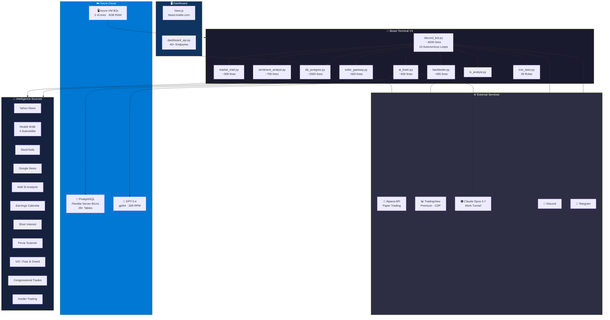

---

## 🔄 10 Autonomous Loops

Beast runs **10 independent async loops**, each on its own timer. All are crash-resilient with try/except and auto-restart.

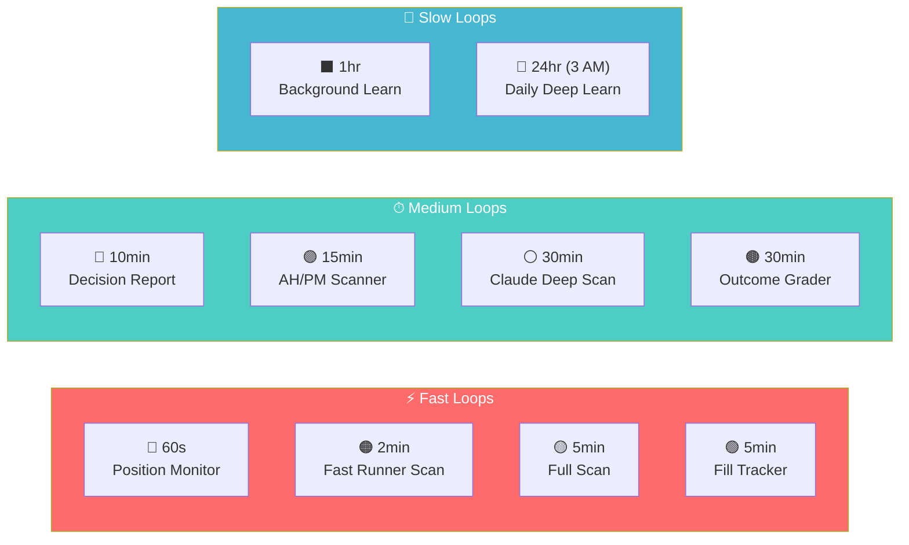

| # | Loop | Interval | Purpose | Key Actions |
|---|------|----------|---------|-------------|
| 1 | 🔴 **Position Monitor** | 60s | Real-time position management | Scalp +2%, dip reload -2%, pyramid +3%, tier-based loss cuts, trailing stops |
| 2 | 🟠 **Fast Runner Scan** | 2min | Market-wide momentum detection | Alpaca `most_active` API → scan for >3% movers → quick buy evaluation |
| 3 | 🟡 **Full Scan** | 5min | Comprehensive analysis | TV indicators + 9 sentiment sources + confidence engine + GPT-5.4 batch |
| 4 | 🟢 **Fill Tracker** | 5min | Order execution tracking | Monitor fills, record realized P&L, update positions |
| 5 | 🔵 **Decision Report** | 10min | Portfolio communication | Discord embed with positions, P&L, exposure, AI insights |
| 6 | 🟣 **AH/PM Scanner** | 15min | After-hours intelligence | Earnings movers, gap detection, pre-market volume spikes |
| 7 | ⚪ **Claude Deep Scan** | 30min | Institutional-grade analysis | Claude Opus 4.7 deep dive with market intelligence, sector rotation |
| 8 | 🟤 **Outcome Grader** | 30min | Decision quality tracking | Grades past decisions: `was_correct = TRUE/FALSE`, win rate calculation |
| 9 | ⬛ **Background Learning** | 1hr | Continuous market education | 20 stocks/batch, yfinance analysis, earnings pattern recognition |
| 10 | 💎 **Daily Deep Learn** | 24hr (3 AM) | Full learning cycle | Backtest 8 strategies → Claude analysis with 10 frameworks → Store insights → Flush raw data |

### Loop Lifecycle

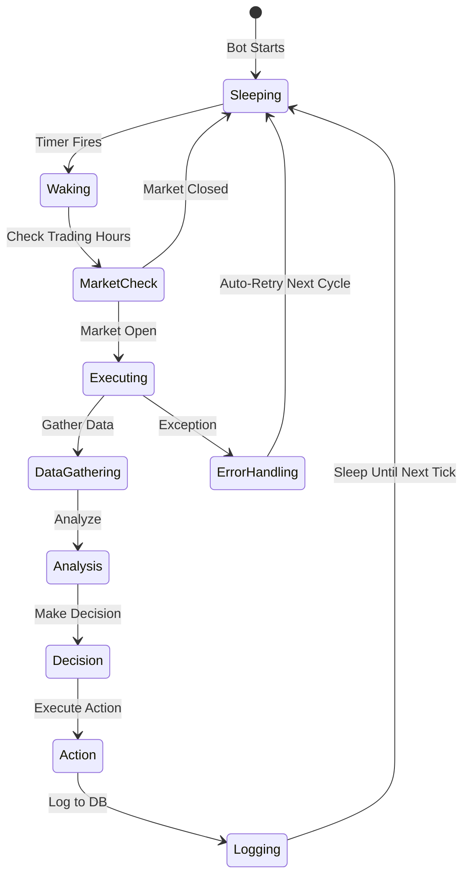

---

## 🚪 Smart Buy Pipeline (7 Gates)

Every single buy must pass through **all 7 gates** sequentially. If any gate blocks, the buy is rejected. Full pipeline is logged for audit.

```
G1:PASS > G2:PASS > G3:BLOCKED sold@374.86
```

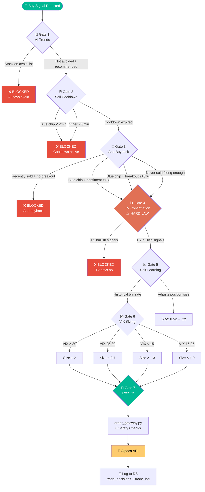

### Gate Details

| Gate | Name | Rule | Bypass Condition |
|------|------|------|-----------------|
| G1 | **AI Trends** | Check Claude daily avoid/buy recommendations | None — AI verdict is law |
| G2 | **Sell Cooldown** | Blue chips: 2min, Others: 5min after last sell | None — prevents churn |
| G3 | **Anti-Buyback** | Don't rebuy recently sold stocks | Blue chip + sentiment ≥+3 **OR** +5% breakout |
| G4 | **TV Confirmation** | **HARD LAW** — needs ≥2 bullish TradingView signals | None — never bypassed |
| G5 | **Self-Learning** | Historical win rate adjusts position size | Always passes, adjusts size |
| G6 | **VIX Sizing** | Market fear adjusts position size | Always passes, adjusts size |
| G7 | **Execute** | Route through order gateway with 8 safety checks | None — final execution |

---

## 🧠 AI Architecture

Beast uses a **hybrid AI architecture** — fast GPT-5.4 for real-time decisions and deep Claude Opus 4.7 for institutional-grade analysis.

### AI Model Selection

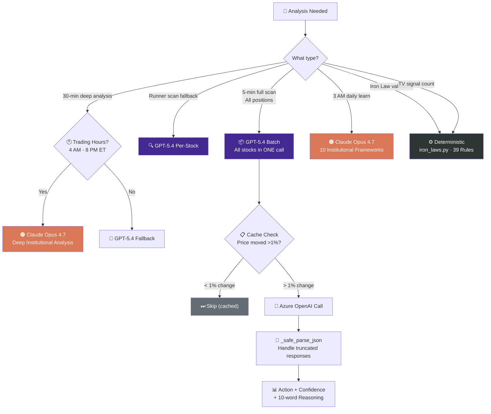

### GPT-5.4 (Azure OpenAI)

| Parameter | Value |
|-----------|-------|
| **Deployment** | `gpt54` on Azure |
| **Rate Limit** | 300 RPM |
| **Token Param** | `max_completion_tokens` |
| **Batch Mode** | All stocks in ONE call, lean prompts |
| **Per-Stock** | Runner scan fallback |
| **Rate Limiting** | 2s between calls |
| **JSON Repair** | `_safe_parse_json` handles truncated responses |
| **Caching** | Skip if price moved <1% since last analysis (5-min TTL) |
| **Stats Tracked** | Calls, success, errors, 429s, timing, tokens |

### Claude Opus 4.7

| Parameter | Value |
|-----------|-------|
| **Access** | Via work tunnel |
| **Usage** | 30-min deep institutional analysis |
| **Hours** | Trading hours only (4 AM - 8 PM ET) as fallback |
| **Daily Learn** | 3 AM with 10 institutional frameworks |
| **Frameworks** | Buffett, Lynch, Dalio, Livermore, CANSLIM, and 5 more |

### AI Skill V5 (`AI_TRADER_SKILL.md`)

The system prompt loaded into both AI models:

- **39 Iron Laws** — Hard rules that can never be broken
- **11 Strategies** — From RSI dip buys to CANSLIM breakouts
- **Past Winners** — Historical examples of successful trades
- **Past Mistakes** — What NOT to do (learned from losses)
- **Institutional Frameworks** — Buffett, Lynch, Dalio, Livermore, CANSLIM
- **Response Format** — Action, Confidence (30-100, never 0), 10-word reasoning

---

## 🗃 Database Schema (28+ Tables)

PostgreSQL V4 schema with **28+ tables** organized into 9 domains.

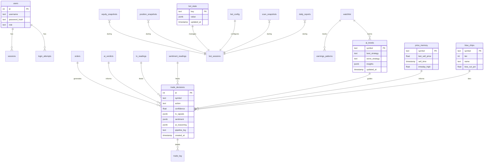

### Domain Breakdown

| Domain | Tables | Purpose |
|--------|--------|---------|
| 🔐 **AUTH** | `users`, `sessions`, `login_attempts` | Dashboard authentication |
| 📈 **TRADING** | `orders`, `ai_verdicts`, `trade_decisions`, `trade_log` | Full trade lifecycle |
| 📊 **MARKET DATA** | `tv_readings`, `sentiment_readings` | Raw market signals |
| 💰 **PORTFOLIO** | `equity_snapshots`, `position_snapshots` | Point-in-time portfolio state |
| 📋 **ACTIVITY** | `activity_log`, `alerts`, `scan_results`, `commands` | Operational audit trail |
| 🎓 **LEARNING** | `watchlist` (213+), `earnings_patterns`, `ai_trends` | Self-learning storage |
| ⚙️ **BOT CORE** | `bot_state`, `bot_sessions`, `price_memory`, `bot_config` (20 settings) | Runtime state & config |
| 🕵️ **INTELLIGENCE** | `blue_chips` (60), `scan_snapshots`, `daily_reports` | Curated intelligence |
| 🔔 **NOTIFICATIONS** | `notifications`, `strategy_signals` | Alert queue |

### Key Tables Deep Dive

| Table | Role | Key Feature |
|-------|------|-------------|
| `bot_state` | KV store replacing ALL in-memory dicts | **Survives restarts** — every dict is now a DB row |
| `blue_chips` | 60 stocks across 3 tiers | Tier 1 (30 mega caps) never sell at loss |
| `trade_decisions` | Full audit trail | TV signals + sentiment + AI + pipeline steps in one row |
| `trade_log` | Deep trade context | AI reasoning, entry/exit logic, P&L |
| `scan_snapshots` | Entire scan result | One JSONB row per scan cycle |
| `price_memory` | Per-stock state | Sell prices, cooldowns, intraday highs |
| `ai_trends` | Learning output | Best/worst strategy per stock, Claude insights |
| `bot_config` | 20 configurable settings | Dashboard-editable, kill switch, mode toggle |

---

## 📡 Market Intelligence (11 Sources)

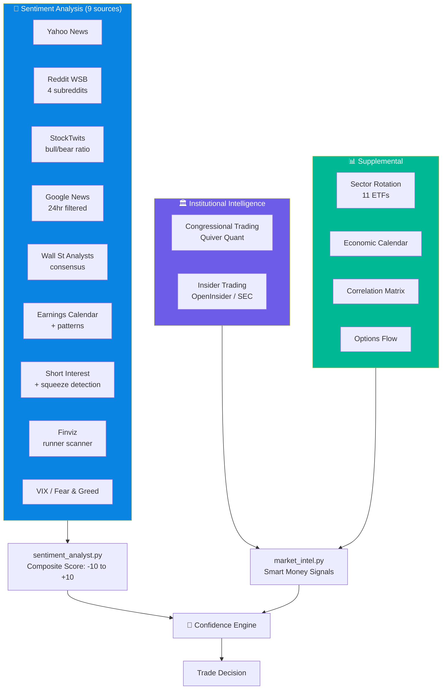

### Source Details

| # | Source | Provider | Signal Type | Update Frequency |
|---|--------|----------|-------------|-----------------|
| 1 | Yahoo News | Yahoo Finance API | Headline sentiment | Every scan |
| 2 | Reddit WSB | 4 subreddits (wsb, stocks, investing, pennystocks) | Social momentum | Every scan |
| 3 | StockTwits | StockTwits API | Bull/bear ratio | Every scan |
| 4 | Google News | Google News RSS | 24hr filtered headlines | Every scan |
| 5 | Wall St Analysts | Aggregated | Buy/sell/hold consensus | Daily |
| 6 | Earnings Calendar | Multiple sources | Upcoming + past patterns | 15min |
| 7 | Short Interest | FINRA data | Squeeze detection | Daily |
| 8 | Finviz Scanner | Finviz screener | Runner detection | 2min |
| 9 | VIX / Fear & Greed | CBOE / CNN | Market-wide fear level | Every scan |
| 10 | Congressional Trades | Quiver Quant | Smart money tracking | Daily |
| 11 | Insider Trading | OpenInsider / SEC | Insider buy/sell patterns | Daily |

---

## 🧪 Backtesting Engine (8 Strategies)

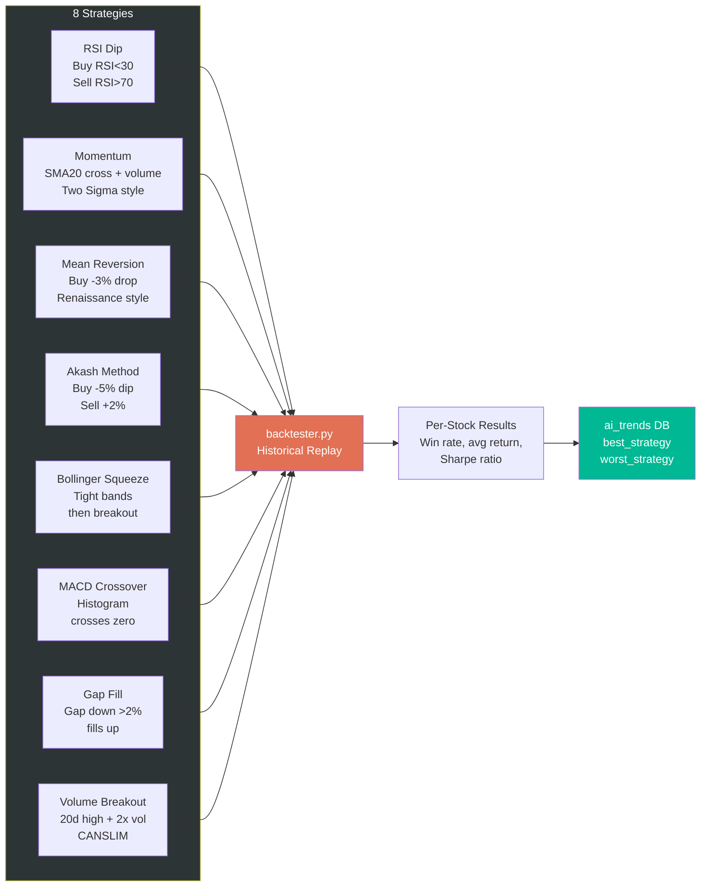

| # | Strategy | Entry Signal | Exit Signal | Inspired By |
|---|----------|-------------|-------------|-------------|
| 1 | `rsi_dip` | RSI < 30 | RSI > 70 | Classic oversold bounce |
| 2 | `momentum` | SMA20 crossover + volume confirm | Trend reversal | Two Sigma |
| 3 | `mean_reversion` | -3% daily drop | Return to mean | Renaissance Technologies |
| 4 | `akash_method` | -5% dip | +2% profit take | Custom — dip buying |
| 5 | `bollinger_squeeze` | Bands tighten → breakout | Bands expand → fade | Bollinger |
| 6 | `macd_crossover` | MACD histogram crosses zero up | Crosses zero down | Gerald Appel |
| 7 | `gap_fill` | Gap down > 2% at open | Gap fills to previous close | Gap fill statistics |
| 8 | `volume_breakout` | 20-day high + 2x avg volume | Trailing stop | CANSLIM / O'Neil |

---

## 🔄 Self-Learning Loop

The bot gets **smarter every single day** through a closed-loop learning cycle.

```mermaid
flowchart TD
    START(["🌙 3 AM Daily Trigger"]) --> BT

    BT["🧪 Backtest 8 Strategies<br/>on 14 stocks"]
    BT --> GRADE["📝 Outcome Grader<br/>was_correct = TRUE/FALSE<br/>on past decisions"]

    GRADE --> GATHER["📊 Gather All Data<br/>• TV readings<br/>• Sentiment scores<br/>• Block trades<br/>• Missed opportunities"]

    GATHER --> CLAUDE["🟠 Claude Opus 4.7<br/>Analyzes with 10 Frameworks"]

    subgraph FRAMEWORKS["🏛 10 Institutional Frameworks"]
        F1["Warren Buffett<br/>Value + Moat"]
        F2["Peter Lynch<br/>Growth at Reasonable Price"]
        F3["Ray Dalio<br/>Macro + Cycles"]
        F4["Jesse Livermore<br/>Momentum + Pivots"]
        F5["CANSLIM<br/>O'Neil Growth"]
        F6["Technical Analysis<br/>Chart Patterns"]
        F7["Quant Models<br/>Statistical Edge"]
        F8["Risk Management<br/>Position Sizing"]
        F9["Market Microstructure<br/>Order Flow"]
        F10["Behavioral Finance<br/>Crowd Psychology"]
    end

    CLAUDE --> FRAMEWORKS
    FRAMEWORKS --> INSIGHTS["💡 Insights Generated<br/>• Avoid list<br/>• Buy recommendations<br/>• Strategy rankings<br/>• Pattern recognition"]

    INSIGHTS --> STORE["🗃 Store in ai_trends DB<br/>best_strategy, worst_strategy<br/>per stock"]

    STORE --> FLUSH["🧹 Flush Raw Data<br/>Keep insights, drop noise"]

    FLUSH --> NEXT_DAY["☀️ Next Trading Day"]
    NEXT_DAY --> READ["📖 Bot reads ai_trends<br/>BEFORE every buy decision"]
    READ --> TRADE["📈 Make Trades<br/>Informed by learnings"]
    TRADE --> GRADE2["📝 Outcome Grader<br/>Grades new decisions"]
    GRADE2 --> WAIT["⏰ Wait for 3 AM"]
    WAIT --> START

    style START fill:#6c5ce7,color:#fff
    style CLAUDE fill:#D97757,color:#fff
    style STORE fill:#00b894,color:#fff
    style FRAMEWORKS fill:#2d3436,color:#fff
```

### Learning Cycle Summary

```
3 AM: Backtest 8 strategies on 14 stocks
  → Outcome grader checks decision accuracy
  → Gather all data (TV, sentiment, blocks, missed trades)
  → Claude analyzes with 10 institutional frameworks
  → Insights stored in ai_trends DB
  → Bot reads ai_trends before every buy decision
  → Outcome grader grades new decisions
  → 3 AM: Repeat (gets smarter every day)
```

---

## 🛡 Risk Management

### Blue Chip Tiers

| Tier | Count | Examples | Loss Cut | Rationale |
|------|-------|---------|----------|-----------|
| 🥇 **Tier 1** | 30 mega caps | AAPL, MSFT, GOOGL, AMZN, NVDA | **Never sell at loss** | These always recover |
| 🥈 **Tier 2** | 20 large caps | AMD, CRM, SHOP, SQ | Cut at **-10%** | Usually recover, but set limit |
| 🥉 **Tier 3** | 10 Reddit favorites | GME, AMC, PLTR, SOFI | Cut at **-8%** | High volatility, tighter stop |

### Position Management

| Rule | Condition | Action |
|------|-----------|--------|
| **Scalp** | Position up +2% | Take partial profit |
| **Dip Reload** | Position down -2% | Add to winning thesis |
| **Pyramid** | Position up +3% | Add to winner |
| **Trailing Stop** | 3% from high | Sell entire position |
| **Daily Loss Limit** | $500 total loss | Halt all trading |
| **Heat Limit** | >65% invested | No new positions |
| **Kill Switch** | Dashboard toggle | Stop all trading immediately |

### Non-Blue-Chip Loss Cuts

| Loss Level | Action |
|-----------|--------|
| -5% | Sell **half** the position |
| -10% | Sell **all** remaining |

### VIX-Based Sizing

| VIX Level | Market Mood | Size Adjustment |
|-----------|-------------|----------------|
| > 30 | 😱 Extreme Fear | **÷ 2** (halve all sizes) |
| 25 - 30 | 😰 High Fear | **× 0.7** (reduce 30%) |
| 15 - 25 | 😐 Normal | **× 1.0** (standard) |
| < 15 | 😎 Complacent | **× 1.3** (boost 30%) |

---

## 🖥 Dashboard (Next.js)

### 19 Pages

| Page | Description |
|------|-------------|
| 📊 **Dashboard** | Overview: P&L, positions, equity curve, alerts |
| 💼 **Positions** | Current holdings with real-time P&L |
| 📈 **Trades** | Trade history with filters and search |
| 🎯 **Decisions** | AI decision audit trail with pipeline logs |
| 🧠 **AI** | AI model stats, verdicts, confidence distribution |
| 📉 **Performance** | Win rate, Sharpe, drawdown, equity curve |
| 💎 **Blue Chips** | Tier management, add/remove/reclassify |
| ⚙️ **Config** | 20 bot settings, kill switch, mode toggle |
| 🧪 **Backtest** | Run and review backtests |
| 🏃 **Runners** | Real-time runner detection results |
| 🛑 **Stops** | Active trailing stops and loss cuts |
| 🏭 **Sectors** | 11-sector rotation analysis |
| 📊 **Analytics** | Deep analytics and custom reports |
| 📋 **Activity** | Activity log and audit trail |
| 🔍 **Scans** | Scan history and snapshots |
| 📰 **News** | Aggregated news with sentiment |
| 🔔 **Notifications** | Alert history and queue |
| 📡 **Feed** | Real-time event feed |
| 🖥 **System** | System health, loop status, resource usage |

### Dashboard Architecture

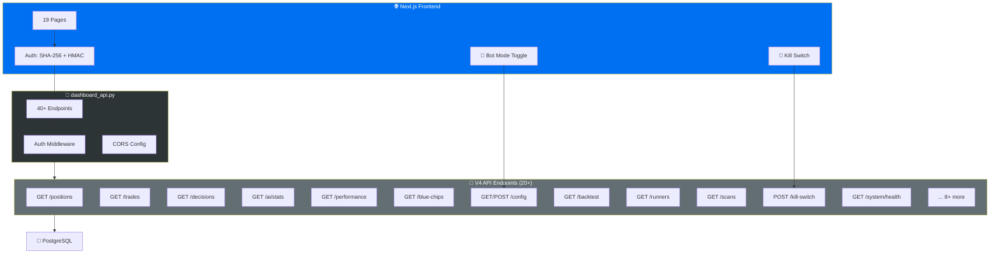

---

## 🔀 Data Flow

End-to-end flow from market data to trade execution to learning.

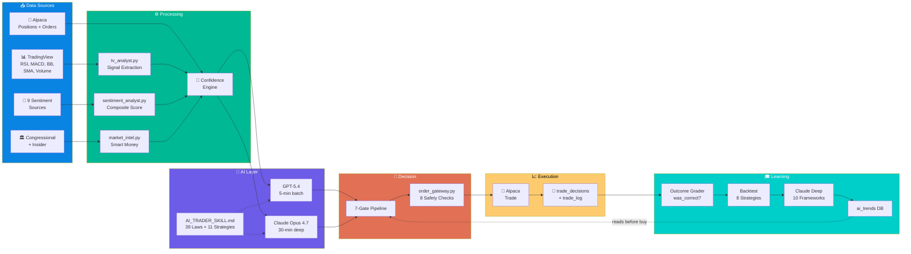

---

## 📁 File Structure

```
beast-terminal-v4/
├── 🐍 discord_bot.py          # ~4,000 lines — Main process, 10 loops, smart_buy pipeline
├── 🧠 ai_brain.py             # ~500 lines  — GPT-5.4 + Claude, batch analysis, rate limiting
├── 🗃 db_postgres.py           # ~2,000 lines — 28 tables, 60+ methods, connection pooling
├── 🚀 order_gateway.py         # ~600 lines  — Single-writer to Alpaca, 8 safety checks
├── 📰 sentiment_analyst.py     # ~700 lines  — 9 sentiment sources, composite scoring
├── 🕵️ market_intel.py          # ~500 lines  — 11 intelligence sources
├── 🧪 backtester.py            # ~400 lines  — 8 strategies, replay + historical
├── 📊 tv_analyst.py            # TradingView indicator parsing via CDP
├── ⚖️ iron_laws.py             # 39 rules validation engine
├── 📋 AI_TRADER_SKILL.md       # System prompt for both AIs
├── 🔗 dashboard_api.py         # ~1,800 lines — 40+ endpoints, auth, CORS
├── 📦 models/
│   └── __init__.py             # Data classes and type definitions
└── 🖥 dashboard/               # Next.js frontend
    ├── pages/                  # 19 pages
    ├── components/             # Reusable UI components
    ├── lib/                    # API client, auth, utilities
    └── public/                 # Static assets
```

### Lines of Code Summary

| File | Lines | Responsibility |
|------|-------|---------------|
| `discord_bot.py` | ~4,000 | Main orchestrator — 10 loops, pipeline, Discord integration |
| `db_postgres.py` | ~2,000 | Database layer — 28 tables, 60+ methods, connection pooling |
| `dashboard_api.py` | ~1,800 | Dashboard backend — 40+ endpoints, authentication |
| `sentiment_analyst.py` | ~700 | Sentiment aggregation from 9 sources |
| `order_gateway.py` | ~600 | Trade execution — single writer, 8 safety checks |
| `ai_brain.py` | ~500 | AI orchestration — GPT-5.4, Claude, caching, rate limiting |
| `market_intel.py` | ~500 | Market intelligence — 11 sources |
| `backtester.py` | ~400 | Strategy backtesting — 8 strategies |
| **Total** | **~10,500+** | |

---

## ☁️ Azure Resources & Cost

| Resource | SKU | Monthly Cost | Purpose |
|----------|-----|-------------|---------|
| 🖥 **Virtual Machine** | B2s (2 vCores, 4 GB RAM) | ~$30 | Runs all Python processes 24/7 |
| 🐘 **PostgreSQL** | Flexible Server B1ms | ~$15 | 28+ tables, persistent state |
| 🧠 **GPT-5.4** | `gpt54` deployment (300 RPM) | ~$63 | 5-min batch analysis, runner fallback |
| | | **~$108/mo** | **Total infrastructure cost** |

> 💡 **Cost efficiency**: The entire trading infrastructure costs less than a single monthly subscription to most trading platforms.

---

## 📊 Diagrams

### Complete System Flow (Simplified)

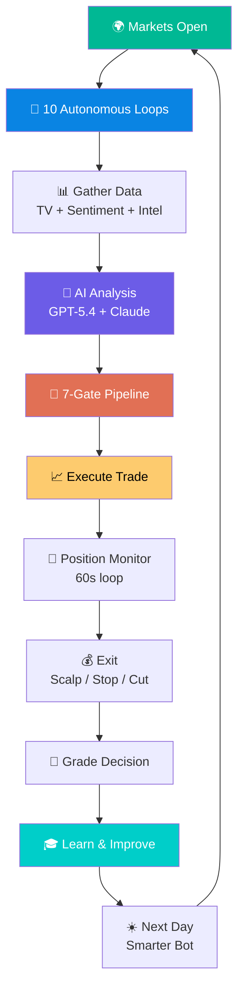

---

## 📜 Version History

| Version | Date | Key Changes |
|---------|------|-------------|
| **V1** | — | Basic Discord bot, manual trading |
| **V2** | — | Added AI (GPT-4), sentiment, TradingView |
| **V3** | — | PostgreSQL, backtesting, blue chip tiers |
| **V4** | Current | Hybrid AI (GPT-5.4 + Claude), 7-gate pipeline, self-learning, 28+ tables, 10 loops, dashboard |

---

<div align="center">

**🐻 Beast Terminal V4** — *An AI that trades, learns, and evolves — 24/7, fully autonomous.*

Built by **Akash** · Powered by **Azure + Alpaca + GPT-5.4 + Claude Opus 4.7**

</div>
