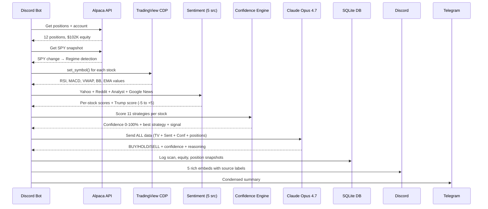
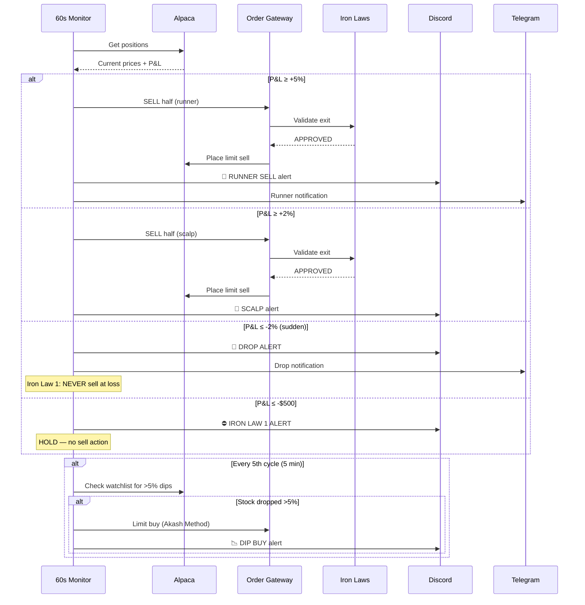
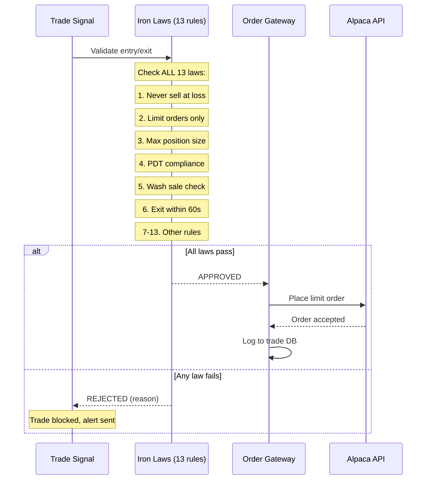
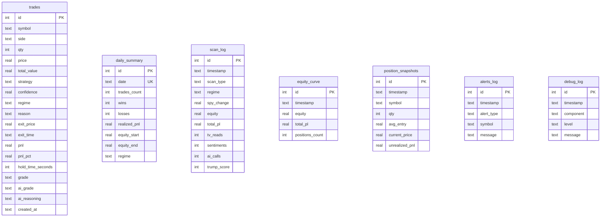
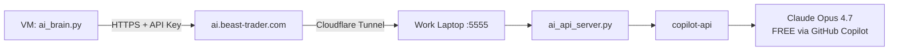
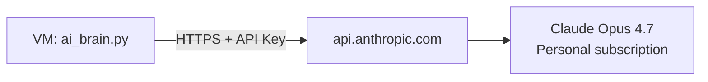
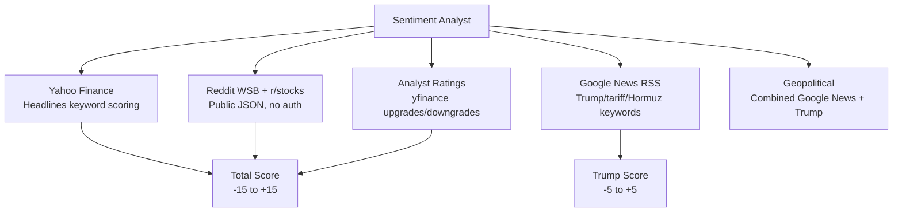

# 🦍 Beast Trader V3 — Complete Architecture & Handoff Document

> **Purpose**: This document contains EVERYTHING a new AI (or human) needs to understand, maintain, and extend Beast Trader V3. Written for handoff from GitHub Copilot (work) to personal Claude subscription.
>
> **Last Updated**: April 29, 2026
> **Author**: Built by Copilot CLI (Claude Opus 4.7) for Akash Pargat

---

## Table of Contents
1. [System Overview](#1-system-overview)
2. [Architecture Diagram](#2-architecture-diagram)
3. [Infrastructure](#3-infrastructure)
4. [Data Flow](#4-data-flow)
5. [Component Deep Dive](#5-component-deep-dive)
6. [Database Schema](#6-database-schema)
7. [Autonomous Trading Loop](#7-autonomous-trading-loop)
8. [Iron Laws (Hardcoded)](#8-iron-laws)
9. [AI Brain Architecture](#9-ai-brain-architecture)
10. [TradingView Integration](#10-tradingview-integration)
11. [Sentiment System](#11-sentiment-system)
12. [Confidence Engine](#12-confidence-engine)
13. [Dashboard](#13-dashboard)
14. [Credentials & Config](#14-credentials--config)
15. [Deployment Guide](#15-deployment-guide)
16. [Known Issues & TODOs](#16-known-issues--todos)
17. [File Map](#17-file-map)
18. [Lessons Learned](#18-lessons-learned)

---

## 1. System Overview

Beast Trader V3 is a **fully autonomous AI-powered day trading bot** that:
- Monitors 12+ stock positions every **60 seconds**
- Runs full analysis (TV + Sentiment + AI + Confidence) every **5 minutes**
- Auto-executes trades: scalp at +2%, runner sell at +5%, dip buy at -5%
- Sends alerts to **Discord** and **Telegram**
- Provides a **live web dashboard** at `dashboard.beast-trader.com`
- Uses **Claude Opus 4.7** for AI analysis (currently via work GitHub Copilot)
- Follows **13 hardcoded Iron Laws** that cannot be bypassed by AI

### Key Principle: "Never Sell at a Loss" (Iron Law 1)
This is ABSOLUTE. The AI can suggest, but the code enforces. No override exists.

### Trading Philosophy: "Akash Method"
Buy oversold dips → Set limit sell at +2% → Take half profit → Let runner ride → Repeat

---

## 2. Architecture Diagram

```mermaid
graph TB
    subgraph "Work Laptop"
        CA[copilot-api<br/>Claude Opus 4.7<br/>FREE unlimited]
        FS[Flask Server<br/>:5555]
        CF1[Cloudflare Tunnel<br/>beast-ai]
        CA --> FS
        FS --> CF1
    end

    subgraph "Cloudflare"
        AI_URL[ai.beast-trader.com]
        DASH_URL[dashboard.beast-trader.com]
        API_URL[api.beast-trader.com]
        CF1 --> AI_URL
        CF2 --> DASH_URL
        CF3 --> API_URL
    end

    subgraph "Azure VM (beast-trader-vm)"
        subgraph "Discord Bot Process"
            BOT[discord_bot.py<br/>Main Process]
            MON[Position Monitor<br/>Every 60s]
            SCAN[Full Scan<br/>Every 5min]
            DEC[Decision Report<br/>Every 10min]
            BOT --> MON
            BOT --> SCAN
            BOT --> DEC
        end

        subgraph "Data Sources"
            TV[TradingView Desktop<br/>CDP :9222]
            ALP[Alpaca API<br/>Paper Trading]
            SENT[Sentiment Analyst<br/>5 Sources]
        end

        subgraph "Processing"
            IL[Iron Laws<br/>13 Hardcoded Rules]
            CE[Confidence Engine<br/>11 Strategies]
            OG[Order Gateway<br/>Single Writer]
            AB[AI Brain Client<br/>Remote HTTP]
        end

        subgraph "Dashboard"
            DAPI[Dashboard API<br/>Flask :8080]
            DUI[Dashboard UI<br/>Next.js :3000]
            CF2[Cloudflare Tunnel<br/>beast-vm]
            CF3[Cloudflare Tunnel<br/>beast-vm]
        end

        subgraph "Storage"
            DB[(SQLite<br/>beast_trades.db)]
            LOG[beast.log]
        end

        MON --> ALP
        MON --> OG
        SCAN --> TV
        SCAN --> SENT
        SCAN --> CE
        SCAN --> AB
        AB --> AI_URL
        OG --> ALP
        OG --> IL
        DAPI --> DB
        DAPI --> ALP
        DUI --> DAPI
        BOT --> DB
    end

    subgraph "Notifications"
        DC[Discord<br/>Beast Trader #5020]
        TG[Telegram<br/>@KashKingTraderBot]
    end

    BOT --> DC
    BOT --> TG
```

---

## 3. Infrastructure

### Azure VM
| Property | Value |
|----------|-------|
| **Name** | beast-trader-vm |
| **Size** | Standard_D2s_v5 (2 vCPU, 8 GB RAM) |
| **OS** | Windows Server 2022 |
| **Region** | West US 2 |
| **Cost** | ~$35/month (covered by $150/mo Azure credit) |
| **IP** | 172.179.234.42 |
| **Login** | beastadmin / [See Azure Portal] |
| **Resource Group** | beast-trading-rg |
| **Subscription** | Visual Studio Enterprise (718ce05c-64d1-48b0-a57e-45dc198ccc69) |

### Software on VM
| Software | Version | Path |
|----------|---------|------|
| Python | 3.12 | `C:\Python312\python.exe` |
| Node.js | 24.x | `C:\Program Files\nodejs\` |
| Git | 2.54.0 | `C:\Program Files\Git\cmd\git.exe` |
| TradingView Desktop | MSIX | Windows Apps (auto-CDP on :9222) |
| Cloudflared | Latest | Installed as Windows service |
| Chocolatey | 2.7.1 | Package manager |

### Code Location on VM
```
C:\beast-test2\           ← Main code directory (cloned from GitHub)
C:\beast-test2\.env       ← Credentials (NOT in git)
C:\beast-test2\dashboard\ ← Next.js frontend
C:\beast-test2\engine\    ← Confidence engine, policy engine
C:\beast-test2\models\    ← Dataclasses
```

### Cloudflare Tunnels
| Tunnel | Source | Destination | Purpose |
|--------|--------|-------------|---------|
| beast-ai | ai.beast-trader.com | Work laptop :5555 | AI Brain (Claude) |
| beast-vm | dashboard.beast-trader.com | VM :3000 | Dashboard UI |
| beast-vm | api.beast-trader.com | VM :8080 | Dashboard API |

### Domain
- **beast-trader.com** registered on Cloudflare (~$10/year)

---

## 4. Data Flow

### Full Scan Sequence (Every 5 Minutes)



### 60-Second Position Monitor



### Order Execution Flow



---

## 5. Component Deep Dive

### discord_bot.py (~100KB, 1900+ lines)
**THE MAIN PROCESS.** Everything runs inside this.
- 24+ interactive commands (!g, !positions, !scan, !backtest, etc.)
- 3 autonomous background tasks (discord.ext.tasks):
  - `position_monitor` — every 60s
  - `full_scan` — every 5 min
  - `decision_report` — every 10 min
- All blocking calls (AI, sentiment, TV) run in `asyncio.to_thread()` to avoid Discord heartbeat timeouts
- Auto-scalp, auto-runner, auto-dip-buy logic in 60s monitor
- Rich embed reports with clear source labels (TV, Sentiment, Confidence, AI)

### order_gateway.py
**SINGLE WRITER to Alpaca.** Thread-safe via lock.
- ALL order mutations go through here — no other module talks to Alpaca for orders
- Validates via Iron Laws before every order
- Methods: `place_buy()`, `place_sell()`, `get_positions()`, `get_account()`, `get_open_orders()`
- Limit orders ONLY (Iron Law 2)

### iron_laws.py
**13 HARDCODED trading rules.** Python if/else — cannot be bypassed by AI.
- Priority: SAFETY > REGULATORY > RISK_CAP > STRATEGY > PROFIT
- Iron Law 1: NEVER sell at loss (ABSOLUTE, no override)
- Iron Law 2: Limit orders only (no market orders)
- Iron Law 6: Exit order within 60 seconds of entry
- Iron Law 11: No trading 1 day before earnings
- Functions: `validate_entry()`, `validate_exit()`, `is_approved()`, `get_rejections()`

### ai_brain.py (VM version — remote client)
**Calls work laptop's AI server via Cloudflare tunnel.**
- URL: `https://ai.beast-trader.com` (permanent, Cloudflare named tunnel)
- Auth: `X-API-Key` header with shared secret
- Falls back to deterministic mode if AI offline
- Same interface as v2 local version — all code works unchanged
- Methods: `analyze_stock()`, `bull_bear_debate()`, `morning_briefing()`
- **⚠️ MIGRATION TARGET: Replace with direct Anthropic API call**

### ai_api_server.py (runs on WORK LAPTOP)
**Flask server exposing copilot-api (Claude Opus 4.7) via HTTP.**
- Port 5555 → exposed via Cloudflare tunnel → `ai.beast-trader.com`
- Endpoints: `/health`, `/analyze`, `/debate`, `/briefing`
- Protected by API key authentication
- **⚠️ THIS IS THE COMPONENT TO REPLACE WITH DIRECT CLAUDE API**

### tv_cdp_client.py
**Direct CDP connection to TradingView Desktop.**
- TradingView Desktop app auto-serves CDP on port 9222 (no flag needed)
- Connects via WebSocket with `suppress_origin=True`
- Must target the `/chart` page target (not main page)
- 3 fallback methods for reading study values:
  1. `dataWindowView().items()` (visible mode)
  2. `data().bars()` (headless mode)
  3. `_study._data._data` (fallback)
- After-hours: values show ∅ — this is NORMAL, not a bug
- Methods: `set_symbol()`, `get_study_values()`, `get_quote()`, `get_pine_labels()`

### sentiment_analyst.py
**5 data sources, all free, all autonomous:**
1. **Yahoo Finance** — headlines keyword scoring (yfinance library)
2. **Reddit WSB + r/stocks** — public JSON API, no auth needed
3. **Analyst ratings** — upgrades/downgrades from yfinance
4. **Google News RSS** — Trump/tariff/Hormuz keyword scanning (feedparser)
5. **Geopolitical** — combined from Google News + Trump-specific queries
- ETFs (SPY, QQQ) skip analyst ratings (would cause 404 error)
- All sources have freshness TTLs (15 min to 1 hour)
- Graceful degradation if any source fails

### engine/confidence_engine.py
**Multi-strategy scoring across all 11 strategies (A-K).**
- Strategies: ORB Breakout, Gap & Go, Fair Value Gap, VWAP Bounce, Red to Green, Quick Flip, Touch & Turn, Blue Chip Reversion, Akash Method (G), SMA Trend Follow, Sector Momentum
- Regime-aware: different strategies enabled per regime
- Toxic combos: certain strategies blocked in certain regimes
- Component weights: technical 25%, sentiment 15%, strategy_fit 20%, momentum 15%, analyst 10%, volume 10%, regime_bonus 5%
- Output: 0-100% confidence + signal (STRONG_BUY/BUY/HOLD/NO_TRADE)

### trade_db.py
**SQLite database — foundation for ALL analytics.**
- Tables: trades, daily_summary, strategy_stats, position_snapshots, alerts_log, scan_log, equity_curve, debug_log
- Auto-creates all tables on init
- Methods: `log_entry()`, `log_exit()`, `log_scan()`, `log_equity()`, `snapshot_positions()`
- Analytics: `get_overall_stats()`, `get_stats_by_strategy()`, `get_stats_by_stock()`, `get_stats_by_regime()`, `get_stats_by_day()`

### dashboard_api.py
**Flask JSON API serving data from SQLite for the React frontend.**
- Port 8080 → `api.beast-trader.com` via Cloudflare tunnel
- CORS enabled for cross-origin requests
- Endpoints: `/api/portfolio`, `/api/trades`, `/api/scans`, `/api/equity`, `/api/analytics`, `/api/system`, `/api/debug`, `/api/alerts`

### dashboard/ (Next.js)
**React frontend — live trading dashboard.**
- Next.js 14 + Tailwind CSS, dark theme
- 6 pages: Dashboard, Positions, Trades, Scans, Analytics, System
- Auto-refreshes every 60 seconds
- Calls `api.beast-trader.com` for all data
- Port 3000 → `dashboard.beast-trader.com` via Cloudflare tunnel

---

## 6. Database Schema



---

## 7. Autonomous Trading Loop

### Three Cadences

| Cadence | Interval | What It Does |
|---------|----------|--------------|
| **Position Monitor** | 60 seconds | Check P&L, auto-scalp +2%, auto-runner +5%, dip buy -5%, drop alerts, Iron Law 1 alerts |
| **Full Scan** | 5 minutes | TV indicators + 5-source sentiment + 11-strategy confidence + Claude AI analysis → Discord report |
| **Decision Report** | 10 minutes | Portfolio summary with all positions, orders, AI verdicts |

### Schedule
```
4:00 AM - 9:29 AM  → Extended hours: lighter scan, gap detection
9:30 AM - 4:00 PM  → MARKET HOURS: full pipeline runs
4:00 PM - 8:00 PM  → Post-market: monitor runners, extended hours movers
8:00 PM - 4:00 AM  → OFF: skip scans, only log
```

### Auto-Trade Rules (in 60s monitor)
- **+5% or more**: Sell HALF at market-ish price (0.1% below current) → "Runner" sell
- **+2% to +5%**: Place limit sell for HALF at +2.5% above entry → "Scalp" sell
- **>5% daily drop on watchlist stock** (not held): Limit buy at 0.2% below current → "Akash Method" dip buy
- **All sells are LIMIT orders** (Iron Law 2)
- **Never sell at loss** (Iron Law 1 — no exceptions, ever)

---

## 8. Iron Laws

| # | Law | Priority | Enforcement |
|---|-----|----------|-------------|
| 1 | **NEVER sell at loss** | SAFETY | ABSOLUTE — alert at -$500 but HOLD |
| 2 | Limit orders only | REGULATORY | OrderGateway rejects market orders |
| 3 | Max position size: 10% of equity | RISK_CAP | Validated before entry |
| 4 | PDT compliance (3 day trades / 5 days) | REGULATORY | Checked before entry |
| 5 | Wash sale: no re-buy within 30 days of loss sale | REGULATORY | Last sell times tracked |
| 6 | Exit order within 60s of entry | STRATEGY | Auto-placed by OrderGateway |
| 7 | No trading without technicals | STRATEGY | Requires TV data |
| 8 | No trading without sentiment | STRATEGY | Requires at least Yahoo |
| 9 | Max 5 open positions | RISK_CAP | Position count check |
| 10 | Min $5 stock price | SAFETY | Skip penny stocks |
| 11 | No trading 1 day before earnings | SAFETY | Earnings calendar check |
| 12 | Kill switch: halt at -$500 daily P&L | SAFETY | Halts all trading |
| 13 | 2 consecutive losses → halt | SAFETY | Loss streak tracking |

---

## 9. AI Brain Architecture

### Current Setup (copilot-api — WORK GitHub)



**Problems with current setup:**
1. Depends on work laptop being ON
2. Uses work GitHub Copilot (not personal)
3. copilot-api must be running
4. Cloudflare tunnel must be running on laptop

### Target Setup (Personal Claude API)



**Migration plan:**
1. Get Anthropic API key from console.anthropic.com
2. Replace `ai_brain.py` to call Anthropic directly (no tunnel needed)
3. Remove dependency on work laptop entirely
4. Keep `ai.beast-trader.com` tunnel as backup/fallback

### AI API Authentication
- Header: `X-API-Key: beast-v3-sk-7f3a9e2b4d1c8f5e6a0b3d9c`
- Set in `.env` as `AI_API_KEY`
- Required on `/analyze`, `/debate`, `/briefing` endpoints
- `/health` is public (no sensitive data)

---

## 10. TradingView Integration

### How It Works
- TradingView Desktop (MSIX app) serves Chrome DevTools Protocol on port 9222
- **CRITICAL**: Must launch with `--remote-debugging-port=9222` flag
- The MSIX app does NOT auto-enable CDP — it must be explicitly launched with the flag
- On Windows Server (VM), need to `takeown` + `icacls` the WindowsApps folder first
- Python connects via WebSocket to the `/chart/` page target (NOT the homepage!)
- Must use `suppress_origin=True` on WebSocket connection (avoids 403)

### VM Setup (One-Time)
```powershell
# 1. Take ownership of TV app folder (Admin cmd)
takeown /f "C:\Program Files\WindowsApps\TradingView.Desktop_3.1.0.7818_x64__n534cwy3pjxzj" /r /d Y
icacls "C:\Program Files\WindowsApps\TradingView.Desktop_3.1.0.7818_x64__n534cwy3pjxzj" /grant beastadmin:F /t

# 2. Launch with CDP flag
"C:\Program Files\WindowsApps\TradingView.Desktop_3.1.0.7818_x64__n534cwy3pjxzj\TradingView.exe" --remote-debugging-port=9222

# 3. Verify: http://localhost:9222/json should show TV targets
```

### Study Name Matching (Case-Insensitive, Partial)
TV returns full study names, not abbreviations. The `tv_analyst.py` uses partial matching:
| TV Study Name | Match Pattern | What We Read |
|---------------|--------------|-------------|
| `Relative Strength Index` | `'relative strength' in name` | RSI value |
| `Moving Average Convergence Divergence` | `'convergence divergence' in name` | MACD, Histogram, Signal |
| `Volume Weighted Average Price` | `'volume weighted average' in name` | VWAP |
| `Bollinger Bands` | `'bollinger' in name` | Upper, Basis, Lower |
| `Moving Average Exponential` | `'exponential' in name` | EMA (first=9, second=21) |
| `Moving Average` | `'moving average' in name` (not exponential) | SMA 20 |
| `Guru Shopping Test` | `'guru' in name` | Custom strategy signals |

### CDP Target Selection
Multiple targets exist on port 9222. Must find the `/chart/` page:
```python
# WRONG: finds homepage (no chart data)
for t in targets:
    if 'tradingview.com' in t['url']:  # Matches homepage!

# RIGHT: find the chart page specifically
for t in targets:
    if 'tradingview.com/chart' in t['url'] and t['type'] == 'page':
```

### What We Read from TV
| Indicator | Source | Usage |
|-----------|--------|-------|
| RSI (14) | Built-in study | Overbought/oversold detection |
| MACD + Histogram | Built-in study | Momentum + divergence |
| VWAP | Built-in study | Institutional buy/sell level |
| Bollinger Bands | Built-in study | Volatility + mean reversion |
| EMA 9/21 | Built-in study | Trend direction + crossovers |
| SMA 20 | Built-in study | Long-term trend |
| Ichimoku Cloud | Built-in study | Support/resistance |
| Volume | Built-in study | Volume analysis |
| Guru Shopping | Custom Pine | FVG, R2G, VWAP-σ signals |
| Confluence Score | Calculated | How many indicators agree (0-10) |

### Known Issues (Solved)
1. **Chrome background throttling**: Chrome suspends inactive tabs → study values empty. Fix: use TV Desktop app instead.
2. **MSIX access denied**: Can't launch TV Desktop directly. Fix: `takeown` + `icacls` on WindowsApps folder.
3. **CDP targeting homepage**: Code found first tradingview.com match (homepage, no data). Fix: match `/chart/` specifically.
4. **Study name mismatch**: TV returns full names like "Moving Average Convergence Divergence" not "MACD". Fix: case-insensitive partial matching.
5. **Studies loading delay**: After `set_symbol()`, need 5s+ wait for indicators to recalculate. Fix: retry if only Volume loads.

---

## 11. Sentiment System

### 5 Data Sources



### Keyword Scoring
- **Bullish keywords**: ceasefire (+3), rate cut (+4), beat estimates (+3), AI growth (+2)
- **Bearish keywords**: tariff (-4), bombing (-5), Hormuz closed (-5), rate hike (-3)
- **Panic keywords**: crash, Black Monday, circuit breaker → instant -5

### Caching
| Source | TTL |
|--------|-----|
| Yahoo | 15 min |
| Reddit | 30 min |
| Analyst | 1 hour |
| Google News | 10 min |

---

## 12. Confidence Engine

### 11 Trading Strategies (A-K)

| Letter | Strategy | Best Regime | Description |
|--------|----------|-------------|-------------|
| A | ORB Breakout | BULL | Opening range breakout in first 15 min |
| B | Gap and Go | BULL | Gap up/down continuation |
| C | Fair Value Gap | BULL | Price gap fill setup |
| D | VWAP Bounce | ALL | Bounce off VWAP level |
| E | Red to Green | BEAR | Stock goes from red to green intraday |
| F | Quick Flip | BEAR | Fast scalp on momentum |
| G | Akash Method | ALL | Buy oversold dip → limit sell → repeat |
| H | Touch and Turn | BEAR | Support/resistance bounce |
| I | Blue Chip Reversion | ALL | Mean reversion on blue chips |
| J | SMA Trend Follow | BULL | Follow 20/200 SMA trend |
| K | Sector Momentum | BULL | Rotate into hot sectors |

### Confidence Thresholds
| Score | Signal | Action |
|-------|--------|--------|
| 90%+ | CONVICTION BUY | Swing, max size, +3%/+8% targets |
| 80% | STRONG BUY | Split, full size, +2.5%/+6% |
| 70% | BUY | Scalp-heavy, +2%/+5% |
| 60% | LEAN BUY | Scalp only, +2% |
| <60% | NO TRADE | Skip |

---

## 13. Dashboard

### URLs
| URL | Service | Port |
|-----|---------|------|
| https://dashboard.beast-trader.com | Next.js frontend | 3000 |
| https://api.beast-trader.com | Flask API | 8080 |

### API Endpoints
| Endpoint | Method | Returns |
|----------|--------|---------|
| `/api/portfolio` | GET | Live positions, equity, P&L, orders |
| `/api/trades` | GET | Trade history with reasoning |
| `/api/trades/today` | GET | Today's trades only |
| `/api/scans` | GET | AI scan log (every 5-min scan) |
| `/api/equity` | GET | Equity curve data points |
| `/api/analytics` | GET | Stats by strategy, stock, regime, day |
| `/api/system` | GET | AI/TV/bot health status |
| `/api/debug` | GET | Debug log entries |
| `/api/alerts` | GET | Alert history |
| `/api/health` | GET | Simple health check |

### Dashboard Pages
1. **Dashboard** — Portfolio overview, positions table, system status, recent scans
2. **Positions** — Card view of each position with P&L bars
3. **Trades** — Full trade history table with strategy + reasoning
4. **Scans** — Every 5-min scan: regime, TV reads, AI calls, Trump score
5. **Analytics** — Win rate, equity curve, strategy/stock/regime/day breakdown
6. **System** — AI/TV/bot health, architecture diagram, debug log

---

## 14. Credentials & Config

### .env File (on VM at C:\beast-test2\.env)
```env
ALPACA_API_KEY=PKJ4RR2DOWCR24YS57MTVTKR2R
ALPACA_SECRET_KEY=<secret>
TELEGRAM_BOT_TOKEN=8274380722:AAGrV7FlmwqAFkS5BT4ckNAxdteG1ULm9NQ
TELEGRAM_CHAT_ID=8795390430
DISCORD_BOT_TOKEN=<token>
DISCORD_CHANNEL_ID=1498363431013716079
AI_API_URL=https://ai.beast-trader.com
AI_API_KEY=beast-v3-sk-7f3a9e2b4d1c8f5e6a0b3d9c
```

### Accounts
| Service | Account | Type |
|---------|---------|------|
| Alpaca | PA37M4LP1YKP | Paper trading |
| Discord | Beast Trader#5020 | Bot |
| Telegram | @KashKingTraderBot | Bot |
| Azure | Visual Studio Enterprise | $150/mo credit |
| Cloudflare | beast-trader.com | Domain + tunnels |
| GitHub | akashpargat/BeastTraderHQ | Private repo |

---

## 15. Deployment Guide

### Starting Everything (One Command)
```batch
C:\beast-test2\START_ALL.bat
```
This starts: Dashboard API (:8080) → Dashboard UI (:3000) → Discord Bot

### Manual Start (3 Terminals)
```batch
:: Terminal 1 - Bot
cd C:\beast-test2 && set PYTHONIOENCODING=utf-8 && C:\Python312\python.exe discord_bot.py

:: Terminal 2 - API
cd C:\beast-test2 && C:\Python312\python.exe dashboard_api.py

:: Terminal 3 - Dashboard
cd C:\beast-test2\dashboard && npx next start -p 3000
```

### Updating Code
```batch
cd C:\beast-test2
"C:\Program Files\Git\cmd\git.exe" pull origin main
```

### Auto-Start on Reboot
- Registry key: `HKCU\SOFTWARE\Microsoft\Windows\CurrentVersion\Run\BeastEngine`
- Points to `C:\beast-test2\start_beast.bat`
- TradingView also auto-starts

### Python Encoding Fix
- Windows console uses cp1252 which breaks emoji
- Fix: `PYTHONIOENCODING=utf-8` set in all .bat files
- Also: `import sys, io; sys.stdout = io.TextIOWrapper(...)` at top of entry points

---

## 16. Known Issues & TODOs

### Critical TODO
- [ ] **Migrate AI from copilot-api to personal Claude subscription** — eliminates laptop dependency

### Known Issues
| Issue | Severity | Workaround |
|-------|----------|------------|
| TV reads 0 after hours | Low | Normal behavior, studies show ∅ after 4 PM |
| Cloudflare quick tunnel URL changes on restart | Fixed | Now using named tunnel with beast-trader.com domain |
| `az vm run-command` can't see user PATH | Low | Use full paths (git, python) |
| Discord report formatting could be better | Low | Works but not beautiful |
| START_ALL.bat doesn't restart on crash | Medium | Need process supervisor (PM2 or similar) |

### Future Features
- Web dashboard enhancements (real-time WebSocket, charts)
- Earnings auto-block from calendar APIs
- Multi-stock TV scanner for new entries
- Claude API as backup AI
- Daily PDF email summary
- Process supervisor for crash recovery

---

## 17. File Map

```
C:\beast-test2\
├── discord_bot.py          # MAIN PROCESS — bot + autonomous loops (1900+ lines)
├── ai_brain.py             # Remote AI client (calls ai.beast-trader.com)
├── ai_api_server.py        # Flask AI server (runs on WORK LAPTOP)
├── order_gateway.py        # Single-writer Alpaca client (thread-safe)
├── iron_laws.py            # 13 hardcoded trading rules
├── tv_cdp_client.py        # TradingView Chrome DevTools Protocol client
├── tv_analyst.py           # Parses TV study values into TechnicalSignals
├── sentiment_analyst.py    # 5-source sentiment (Yahoo/Reddit/Analyst/Google/Trump)
├── regime_detector.py      # Bull/Bear/Choppy/Red Alert detection via SPY
├── sector_scanner.py       # 10 sectors, 48 stocks, rotation detection
├── notifier.py             # Telegram + Discord notifications
├── trade_db.py             # SQLite database (trades, scans, equity curve)
├── performance_tracker.py  # Win rate, P&L, strategy attribution reports
├── backtest_engine.py      # TV-powered backtesting
├── strategy_optimizer.py   # Find optimal RSI thresholds, targets, stops
├── daily_reports.py        # Auto P&L reports with AI reflection
├── dashboard_api.py        # Flask JSON API for dashboard (:8080)
├── beast_mode_loop.py      # Standalone autonomous loop (not used, logic is in discord_bot.py)
├── beast_engine.py         # Alternative entry point
├── monitor.py              # Position monitoring utilities
├── data_collector.py       # Alpaca data collection helpers
├── report_formatter.py     # Fancy table formatter for Telegram
├── run_beast.py            # Entry point for standalone mode
├── auto_start.py           # Setup script for auto-start on reboot
├── START_ALL.bat            # One-click startup (API + Dashboard + Bot)
├── start_beast.bat          # Bot-only startup
├── setup_autostart.bat      # Registry auto-start setup
├── .env                     # Credentials (NOT in git)
├── .gitignore               # Excludes .env, __pycache__, logs, db
├── LESSONS_LEARNED.md       # Deployment pain points documented
├── requirements.txt         # Python dependencies
├── engine/
│   ├── __init__.py
│   ├── confidence_engine.py # 11-strategy scoring
│   ├── policy_engine.py     # Deterministic decision maker
│   ├── bull_bear_debate.py  # AI bull vs bear debate
│   └── master_intelligence.py # THE BRAIN (35K chars)
├── models/
│   └── __init__.py          # All dataclasses (Position, Quote, TechnicalSignals, etc.)
├── dashboard/
│   ├── package.json
│   ├── next.config.js
│   ├── tailwind.config.js
│   ├── tsconfig.json
│   └── src/app/
│       ├── layout.tsx       # Nav + footer
│       ├── page.tsx         # Dashboard home
│       ├── positions/page.tsx
│       ├── trades/page.tsx
│       ├── analytics/page.tsx
│       ├── scans/page.tsx
│       └── system/page.tsx
└── tests/
    └── test_iron_laws.py
```

---

## 18. Lessons Learned

### az vm run-command Pitfalls
1. Runs as SYSTEM — can't see user PATH, env vars, or kill user processes
2. Git writes progress to stderr — PowerShell treats it as error (but it's NOT)
3. If a folder is locked, don't fight it — use a new folder
4. Python encoding: set `PYTHONIOENCODING=utf-8` BEFORE starting Python

### Deployment
1. Use GitHub as the file transfer mechanism — not blob storage, not inline scripts
2. Always test locally before pushing
3. Compile check all Python files before deploying
4. The simplest solution is always the best one

### Trading Bot Specific
1. All blocking calls (AI, sentiment, TV) must run in `asyncio.to_thread()` inside Discord bot — otherwise heartbeat times out
2. Iron Laws must be hardcoded Python, NEVER AI prompts
3. OrderGateway must be single-writer — no multi-writer race conditions
4. TradingView Desktop auto-enables CDP — no command line flag needed
5. After-hours TV values are ∅ — handle gracefully, don't error

---

## 19. Gap Analysis: Us vs Pro AI Trading Bots

### What We Have ✅
1. Multi-strategy engine (11 strategies A-K)
2. Confidence scoring (0-100% with 11 strategies)
3. Iron Laws (13 hardcoded safety rules)
4. Split positions (scalp + runner)
5. Pre-market/after-hours scanning
6. Sector rotation scanning (10 sectors, 48 stocks)
7. **9 sentiment sources** (Yahoo + Reddit WSB + Analyst + Google News + StockTwits + Earnings + Short Interest + Finviz + Fear/Greed VIX)
8. Position monitoring (60s cadence)
9. Auto-buy dips (Akash Method) + Auto-sell (scalp/runner)
10. **Hybrid AI** (Azure GPT-4o for 5min + Claude Opus 4.7 for 30min deep)
11. Live dashboard (beast-trader.com)
12. **Auto-trailing-stop protection** (3% trail on every unprotected position)
13. **Anti-buyback-higher** (won't re-buy stock at higher price than sold)
14. **30-stock expanded watchlist** (SOFI, COIN, ARM, SMCI, etc.)
15. **Short squeeze detection** (>20% short float auto-alert)
16. **Earnings proximity alerts** (warns before earnings dates)

### Critical Gaps 🔴 (Priority Order)

#### #1 TRAILING STOPS ✅ DONE
**Implemented**: Auto-trailing-stop in `position_monitor()` — every 3 cycles checks for unprotected positions and places 3% trailing stops automatically. Also `place_trailing_stop()` in `order_gateway.py` with Iron Law 17 (min 2% trail).

#### #2 BRACKET ORDERS (OCO)
**Current**: Manually place buy, then separately place sells
**Pro**: One-Cancels-Other: buy + stop + target = 1 order
**Implementation**: Alpaca supports `order_class="bracket"` with `take_profit` and `stop_loss` params.
**Impact**: Cleaner execution, no orphaned orders

#### #3 DYNAMIC POSITION SIZING (ATR-based)
**Current**: Fixed qty by price bracket
**Pro**: Size based on ATR (volatility) + confidence + account risk
**Implementation**: Calculate ATR from TV bars, size = (account_risk * equity) / (ATR * multiplier)
**Impact**: Right-sized positions, less risk on volatile stocks

#### #4 EARNINGS REACTION TRADING
**Current**: Set sells before earnings, wait
**Pro**: Buy MORE on beats in after-hours, cut on misses
**Implementation**: Monitor AH price action, auto-buy if gap up >3% with volume
**Impact**: Capture post-earnings momentum instead of missing it

#### #5 OPTIONS FLOW / UNUSUAL ACTIVITY
**Current**: Level 3 approved, never used
**Pro**: Scan unusual call/put sweeps = institutional signals
**Implementation**: Use Alpaca options API or Unusual Whales data
**Impact**: Front-run institutional moves

#### #6 SHORTING
**Current**: Shorting enabled, never used (long-only)
**Pro**: Short weak stocks on red days = profit from drops
**Implementation**: Add short strategies to confidence engine, use `side='sell'` for short
**Impact**: Profit on down days instead of just bleeding

#### #7 REAL-TIME NEWS NLP
**Current**: Yahoo/Reddit/Google RSS (batch, delayed)
**Pro**: Streaming news with AI scoring (Benzinga Pro, Alpha Vantage)
**Implementation**: WebSocket news feed + Claude analysis on breaking headlines
**Impact**: Catch moves minutes faster

#### #8 PORTFOLIO CORRELATION CHECK
**Current**: 12 positions, mostly tech-correlated
**Pro**: Beta/correlation matrix, ensure diversification
**Implementation**: Calculate pairwise correlation from price history, block correlated entries
**Impact**: Reduce portfolio drawdown by 30-50%

#### #9 SHARPE RATIO / MAX DRAWDOWN
**Current**: Track P&L only
**Pro**: Risk-adjusted returns (Sharpe > 1.5 = good)
**Implementation**: Calculate from equity_curve data in trade_db
**Impact**: Know if we're actually good or just lucky

#### #10 PAIRS TRADING
**Current**: Long-only
**Pro**: Long strong + short weak in same sector = market-neutral
**Implementation**: Requires shorting (#6) first. Find relative strength pairs.
**Impact**: Profit regardless of market direction

### Iron Law 1 Controversy
**Current**: NEVER sell at loss (absolute)
**Pro bots**: Max 1-2% account risk per trade, stop at support
**Our stance**: Keep Iron Law 1 for now. It has saved us (PLTR came back from -5% to green). But consider adding an **optional** "smart stop" that only triggers at technical breakdown levels, not arbitrary percentages. This would be Iron Law 1b — "soft stop at support breakdown" that requires AI + human approval.

### Implementation Priority
```
Phase 1 (Quick wins — Alpaca native features):
  #1 Trailing stops ← 30 min, biggest impact
  #2 Bracket orders ← 30 min, cleaner execution

Phase 2 (Sizing + risk):
  #3 Dynamic sizing ← needs ATR calculation
  #8 Correlation check ← needs price history
  #9 Sharpe tracking ← needs equity curve math

Phase 3 (New strategies):
  #4 Earnings reaction ← needs AH monitoring
  #6 Shorting ← needs short strategy logic
  #10 Pairs trading ← needs shorting first

Phase 4 (Data sources):
  #5 Options flow ← needs data provider
  #7 Real-time news ← needs streaming API
```

---

*This document is the single source of truth for Beast Trader V3. Any new AI or developer should read this FIRST before making changes.*
